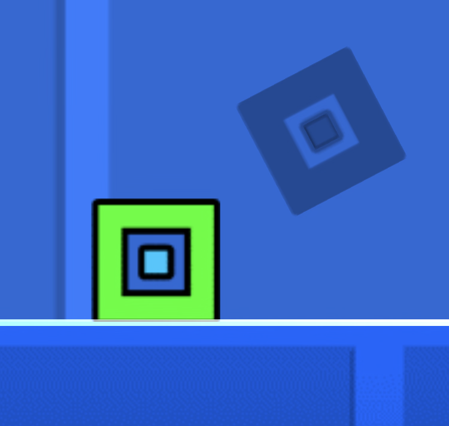

# Best Ghost
A mod that adds your best personal ghosts to Geometry Dash.




## Overview
The Best Ghost Mod is a mod that records your best run and then replays it as a ghost, it is really fun to race against the ghost, trust me. 

> [!TIP]
> If you search for Accurate Hitboxes content, then you can visit [r/AccurateHitboxesMemes on Reddit](https://www.reddit.com/r/AccurateHitboxesMemes)

## Features
The mod is really customisable and has some cool features like:
- A Ghost Menu at the pause of a level, where you can quickly change things without needing to go to the settings
- Ghost Label Status shows you directly if the recording is turned on
- Ghost Offset: You can offset the ghost by X Position so that it plays on the position that is comfortable for you
- Ghost Library: In the settings there is a toggle that sends you to the saved ghosts folder. Then you can share your ghosts with your friends.
- Quick Ghost clear toggle: If you want to record the ghost again, you can easily clear your current ghost in the Ghost Menu™️
- Ghost Gamemodes and Size changes are also supported and are included in the mod.


## Build instructions
For more info, see [the geode docs](https://docs.geode-sdk.org/getting-started/create-mod#build)
```sh
# Assuming you have the Geode CLI set up already
geode build
```

